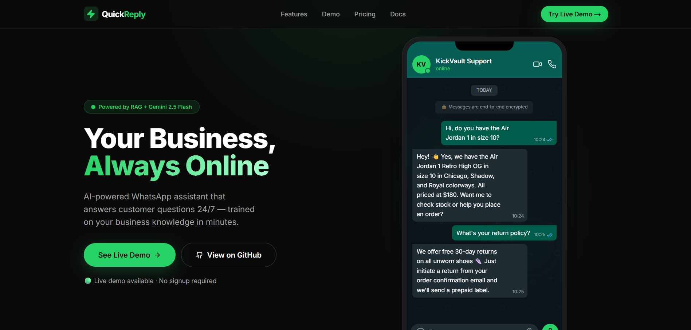
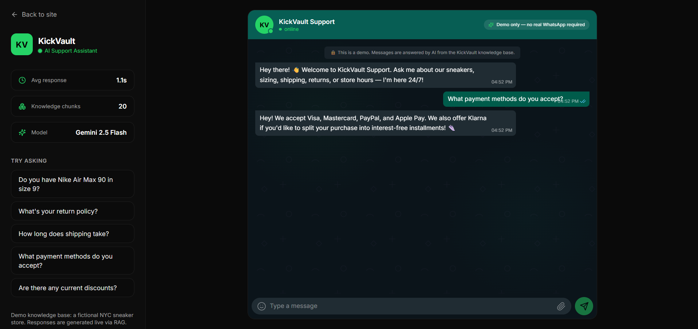
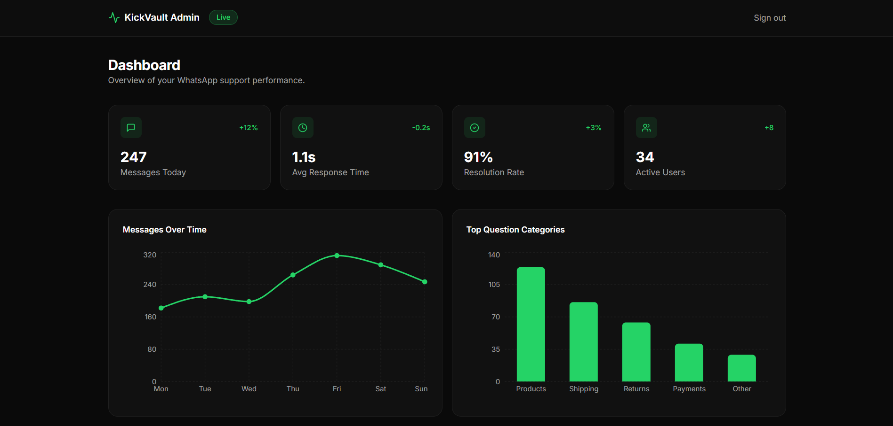

# ⚡ QuickReply AI

**Live Demo:** [quickreply-ai-blue.vercel.app](https://quickreply-ai-blue.vercel.app) &nbsp;|&nbsp; Next.js 14 · TypeScript · Gemini · Vercel

> **Your Business, Always Online.** An AI-powered WhatsApp assistant that answers customer questions 24/7 — trained on your business knowledge in minutes.

QuickReply AI is a production-ready demo of a SaaS WhatsApp support product. It pairs a stunning marketing landing page with a live, in-browser chat demo and an admin analytics dashboard. The assistant is grounded with a **RAG (Retrieval-Augmented Generation)** pipeline over a fictional sneaker store — **KickVault** — so answers stay accurate and on-brand.

🟢 **Live demo available · No signup required**

---

## ✨ Features

- **Landing page** — funded-SaaS-grade marketing site with an animated, pixel-perfect WhatsApp chat mockup.
- **Live browser demo** (`/demo`) — a WhatsApp-style chat UI that streams real AI answers. **No Twilio needed.**
- **Admin dashboard** (`/admin`) — KPI cards, charts (Recharts), and a recent-conversations table.
- **Real WhatsApp mode** (`/api/webhook`) — connect a Twilio WhatsApp number for true two-way messaging.
- **RAG pipeline** — Gemini `gemini-embedding-001` embeddings + an in-memory vector store + `gemini-2.5-flash` generation.

---

## 📸 Screenshots

### Landing Page


### Live Demo


### Admin Dashboard


---

## 🏗️ Architecture

```
                         ┌──────────────────────────────────────┐
                         │            QuickReply AI               │
                         └──────────────────────────────────────┘

  Browser Demo                                 Real WhatsApp
  ────────────                                 ─────────────
  /demo (chat UI)                              Customer's WhatsApp
        │                                              │
        │ POST /api/chat (stream)                      │ inbound message
        ▼                                              ▼
  ┌──────────────┐                            ┌──────────────────┐
  │  Chat Route  │                            │   Twilio Webhook │
  │  (streaming) │                            │  /api/webhook    │
  └──────┬───────┘                            └────────┬─────────┘
         │                                             │
         └──────────────┬──────────────────────────────┘
                        ▼
              ┌───────────────────┐     ┌──────────────────────────┐
              │   RAG pipeline    │────▶│  In-memory vector store   │
              │   (lib/rag.ts)    │     │  (embeddings/knowledge)   │
              └─────────┬─────────┘     └──────────────────────────┘
                        │                          ▲
            retrieve top-k chunks                  │ gemini-embedding-001
                        │                          │
                        ▼                  ┌────────────────┐
              ┌───────────────────┐        │  KickVault KB  │
              │ gemini-2.5-flash  │        │ (20 chunks)    │
              │  (grounded reply) │        └────────────────┘
              └───────────────────┘
```

---

## 🧰 Tech Stack

| Layer        | Technology                                  |
| ------------ | ------------------------------------------- |
| Framework    | Next.js 14 (App Router) + TypeScript strict |
| Styling      | Tailwind CSS + shadcn/ui patterns           |
| AI / LLM     | Google Gemini `gemini-2.5-flash`            |
| Embeddings   | Gemini `gemini-embedding-001`               |
| Vector store | In-memory cosine-similarity search          |
| Streaming    | Vercel AI SDK (`ai`, `@ai-sdk/google`)      |
| WhatsApp     | Twilio WhatsApp API                         |
| Animations   | Framer Motion                               |
| Icons        | Lucide React                                |
| Charts       | Recharts                                     |

---

## 🚀 Getting Started

### 1. Install

```bash
npm install
```

### 2. Configure environment

```bash
cp .env.example .env.local
```

There are **two modes**:

#### Mode A — Browser Demo (recommended, no Twilio)

You only need a Gemini API key. The `/demo` page and `/admin` dashboard work fully.

```env
GEMINI_API_KEY=your_key_here
```

Get a free key at <https://aistudio.google.com/app/apikey>.

#### Mode B — Real WhatsApp (adds Twilio)

To send/receive real WhatsApp messages, also set your Twilio credentials:

```env
GEMINI_API_KEY=your_key_here
TWILIO_ACCOUNT_SID=your_sid_here
TWILIO_AUTH_TOKEN=your_token_here
TWILIO_WHATSAPP_NUMBER=whatsapp:+14155238886
PUBLIC_BASE_URL=https://your-deployment.vercel.app
```

Then point your Twilio WhatsApp Sandbox (or number) webhook to:

```
https://your-deployment.vercel.app/api/webhook
```

### 3. (Optional) Precompute embeddings

The vector store embeds the knowledge base lazily at runtime, but you can
precompute and commit the vectors for faster cold starts:

```bash
GEMINI_API_KEY=your_key_here npm run embed
```

This writes `embeddings/knowledge.json`.

### 4. Run

```bash
npm run dev
```

Open <http://localhost:3000>.

- Landing page → `/`
- Live demo → `/demo`
- Admin dashboard → `/admin` (password: `kickvault2024`)

### 5. Build

```bash
npm run build
```

---

## 📦 Deploy on Vercel

1. Push this repo to GitHub.
2. Import it into [Vercel](https://vercel.com/new).
3. Add `GEMINI_API_KEY` (and the Twilio vars if you want real WhatsApp) in
   **Project → Settings → Environment Variables**.
4. Deploy. That's it.

---

## 📁 Project Structure

```
app/
  page.tsx            # Landing page
  demo/page.tsx       # Browser chat demo
  admin/page.tsx      # Password-gated dashboard
  api/chat/route.ts   # Streaming RAG endpoint (browser)
  api/webhook/route.ts# Twilio WhatsApp webhook
components/
  landing/            # Navbar, Hero, ChatMockup, Features, Pricing, ...
  demo/               # ChatInterface, Sidebar
  admin/              # Dashboard
  ui/                 # Button, Card, Badge, Input
data/kickvault.ts     # 20-chunk knowledge base + system prompt
lib/
  rag.ts              # Retrieval + generation
  vector-store.ts     # In-memory vector store
  embeddings.ts       # Gemini embedding helper + cosine similarity
  twilio.ts           # WhatsApp send + signature verification
embeddings/knowledge.json # Precomputed (or empty) embeddings
scripts/generate-embeddings.ts
```

---

---

## 📝 Notes

- The demo page and admin dashboard work **without** Twilio keys.
- Twilio is only required for real WhatsApp send/receive.
- All TypeScript, strict mode, zero `any`.

---

Built by **Ahmer Aftab**

© 2025 QuickReply AI. Built as a portfolio project.
